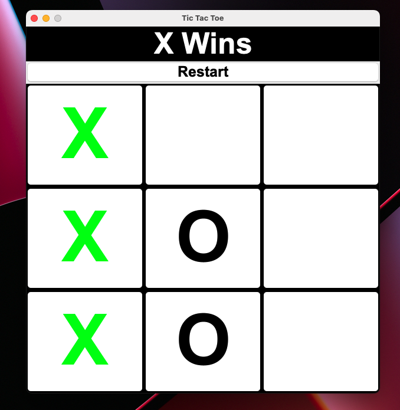
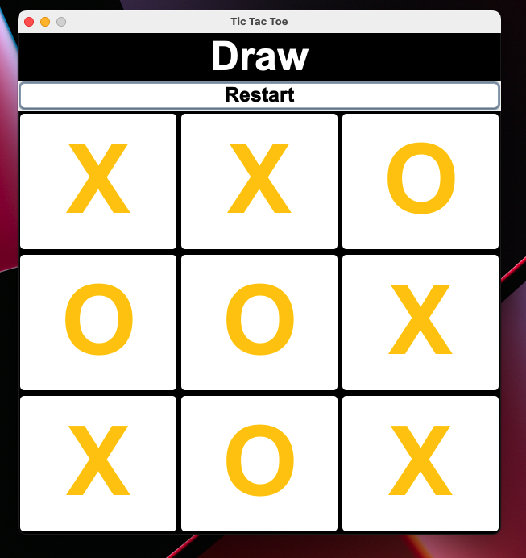

# Tic Tac Toe Game

This is a simple Tic Tac Toe game implemented in Java using Swing for the graphical user interface.

## Features

- Two-player game (Player X and Player O)
- Graphical user interface with buttons for each cell
- Displays the current player's turn
- Highlights the winning combination
- Detects draw conditions
- Restart button to reset the game

## How to Run

1. Ensure you have Java installed on your machine.
2. Clone the repository or download the source code.
3. Navigate to the directory containing the source code.
4. Compile the Java files:
    ```sh
    javac *.java
    ```
5. Run the application:
    ```sh
    java App
    ```

## Files

- [App.java](App.java): The main entry point for the application.
- [TicTacToe.java](TicTacToe.java): Contains the main game logic and GUI setup.
- [Check.java](Check.java): Contains methods to check for win and draw conditions.

## How to Play

1. Run the application.
2. The game board will be displayed with a 3x3 grid of buttons.
3. Player X starts the game. Click on an empty cell to place your mark.
4. Players take turns to place their marks (X or O) on the board.
5. The game will detect and highlight the winning combination or a draw.
6. Click the "Restart" button to reset the game and start over.

## Screenshots
# Win


# Draw


## License

This project is licensed under the MIT License.